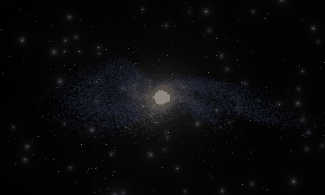
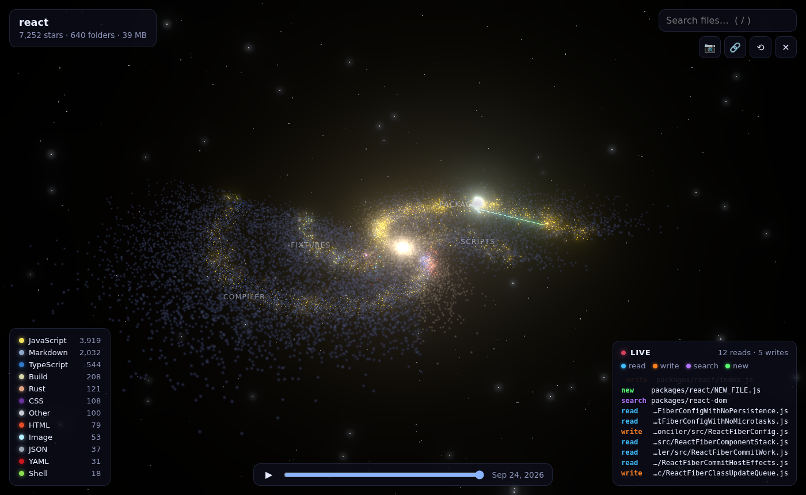

<div align="center">

# ✦ sylaxgen

**Your code is a galaxy.**

Every file is a star. Every folder is a spiral arm. Watch your repository's history form,
and see your AI coding agent fly through it, live.

[**Try it in your browser →**](https://alan891.github.io/sylaxgen/) &nbsp;·&nbsp; `npx sylaxgen`

[](https://github.com/Alan891/sylaxgen/actions/workflows/ci.yml)
[](LICENSE)




<sub>13 years of <code>facebook/react</code>: 7,251 files forming, one commit at a time.</sub>

</div>

## Why

Codebases are huge, and a file tree doesn't give you any feel for their size or shape. sylaxgen gives each one a
shape you can recognise: big folders become long, bright arms, the root files form the core, and every language
has its own color. It's a fun way to explore a new codebase, a good screenshot for your README, and a window into
what your AI agent is actually doing.

## ⚡ Live agent view

Run `sylaxgen` in your project while Claude Code, Codex, Cursor or any other agent works. Every file the agent
**reads** lights up blue, every **edit** flares orange, new files are born green, and a trail follows the agent
from star to star.



- **Any agent, zero setup:** file writes are picked up by watching the file system.
- **Claude Code, full picture:** add the hook below and you also see every `Read`, `Grep` and `Glob`.

```bash
npm i -g sylaxgen
sylaxgen hook-config   # prints the snippet below
```

```json
{
  "hooks": {
    "PostToolUse": [
      {
        "matcher": "Read|Edit|Write|MultiEdit|NotebookEdit|Grep|Glob",
        "hooks": [{ "type": "command", "command": "sylaxgen hook", "timeout": 2 }]
      }
    ]
  }
}
```

Put it in `.claude/settings.json` (per project) or `~/.claude/settings.json` (everywhere). The hook always exits
successfully and never slows the agent down, even when the viewer isn't running.

## Quick start

**In the browser:** open [alan891.github.io/sylaxgen](https://alan891.github.io/sylaxgen/) and paste any public
repository (`owner/repo` or a GitHub URL). You can also open a local folder. It is read entirely in your
browser and never uploaded.

**From the terminal** (private code, git-history timelapse, live agent view):

```bash
npx sylaxgen            # the current directory
npx sylaxgen ~/code/app # any directory
```

| Command | What it does |
| --- | --- |
| `sylaxgen [dir]` | Scan `dir`, open the galaxy and stream live changes |
| `sylaxgen export [dir] -o galaxy.json` | Write a galaxy file you can load in the web app or share |
| `sylaxgen hook` | Claude Code hook: forward tool calls to the viewer |
| `sylaxgen hook-config` | Print the Claude Code settings snippet |

Options: `-p, --port` (default `4777`), `--no-open`, `--no-history`, `--no-watch`.

## Controls

| | |
| --- | --- |
| Drag / scroll | Orbit and zoom |
| Hover / click a star | File details; click flies to it and links to GitHub |
| `/` | Search files (everything else dims) |
| Legend | Click a language to isolate it |
| `Space` | Play the history timelapse |
| 📷 | Save a PNG for your README or socials |
| 🔗 | Copy a shareable link (`?repo=owner/repo`) |

## How the galaxy is drawn

- **Arms:** each top-level folder is one spiral arm, and bigger folders make longer, wider arms.
- **Lanes:** files run along their arm in path order. Each second-level folder gets its own lane, so related files
  stay together.
- **Core:** files in the repository root form the glowing central bulge.
- **Stars:** color is the language (GitHub Linguist palette). Size grows with file size, on a log scale.
- **Timeline:** a star is born on the commit that first added its file (`git log --diff-filter=A`).
- The layout is **deterministic**: the same repository always produces the same galaxy.

## Privacy

- **Web app:** only talks to the public GitHub API, and only for repositories you ask for. Local folders are
  read in your browser. An optional GitHub token (for higher rate limits) is stored in your browser only.
- **CLI:** listens on `127.0.0.1` only, has no telemetry and makes no network calls.

## Development

```bash
npm install
npm run dev        # web app with hot reload
npm run build      # build the viewer into dist/ (also used by the CLI)
node bin/sylaxgen.js .
npm test           # unit + CLI integration tests
npm run test:e2e   # browser tests (Playwright)
```

Project layout: `src/core` holds the layout, model and scanner, shared by the CLI and the browser. `src/web` is
the viewer (three.js). `bin/sylaxgen.js` is the zero-dependency CLI.

## Roadmap

- [ ] Galaxy gallery of famous repositories
- [ ] Commit-by-commit timelapse (changes, not just births) and contributor comets
- [ ] Video export (MP4/GIF) straight from the viewer
- [ ] GitHub Action that keeps a galaxy image in your README up to date
- [ ] Richer agent integrations (Codex, Cursor, Aider event streams)

Ideas and PRs are welcome. If you make something beautiful, share it and tag it `#sylaxgen` ✦

## License

[MIT](LICENSE)
